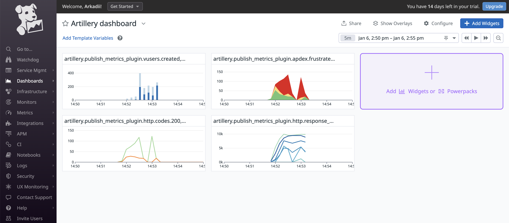
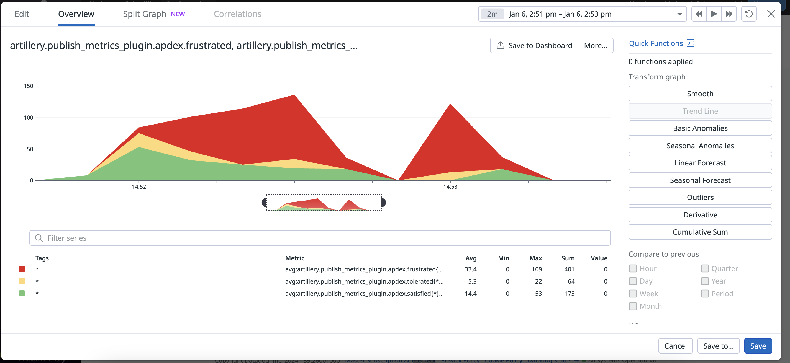
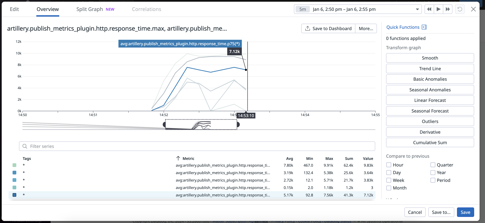
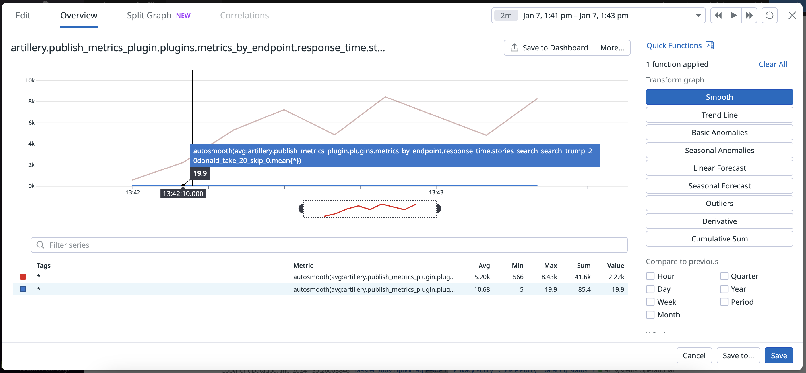

The focus of this project is to create an example of hexagonal architecture in TypeScript for backend application with usage of Elastic.
Some concepts (validation, errors handling, security, ...) were intentionally skipped for simplicity of example.

0. Setting up
```
npm install --global yarn
yarn install
```
1. Start containers
```
docker compose up -d
```

2. Run migrations
```
tsc
yarn run typeorm:migrate
```

Generating new migrations
```
tsc
npm run typeorm migration:generate ./src/migrations/Name -- -d dist/config/db/data-source.js
```


3. Generate authors with CLI:
```
yarn run start-cli:dev --entity=author --count=3
```
4. Generate stories for all authors with CLI:
```
yarn run start-cli:dev --entity=story
```

5. Start app locally
```
yarn run start-web:dev
```
### Load testing

0. Install artillery:
```
yarn add artillery -g
```

1. Install datadog agent:
https://app.datadoghq.eu/signup/agent#macos

2. Run tests:
start Datadog agent (usually starts at http://127.0.0.1:5002/)
```
datadog-agent run
```
start tests
```
artillery run tests/load/stories-load-test.yml
```
3. Results (https://app.datadoghq.eu/dashboard/lists)
Dashboard with metrics:


Example of metric - tolerated, frustrated, satisfied requests:


Example of metric - response time:


Example of metric - avg response time from ElasticSearch (10 ms) and PostgresSQL (5.2k ms):


## Minikube:
Install via ```brew install minikube```

Run minikube
```
minikube start
minikube dashboard
```
Push local image to Docker hub:
```
docker tag koa-ts-elastic-hexagonal-nodeapp:latest ark9606/koa-ts-elastic-hex-repo
docker push ark9606/koa-ts-elastic-hex-repo
```

Create deployment
```
kubectl apply -f ./k8s/deployments/stories-app.yml
```
Check deployment
```
kubectl get pods
kubectl logs nodejs-deployment-d7485d79c-6ht54
```
Expose the Pod to the public internet 
```
kubectl expose deployment nodejs-deployment --type=LoadBalancer --port=3000
```
Check created service:
```
kubectl get services
```
Run service:
```
minikube service nodejs-deployment
```
